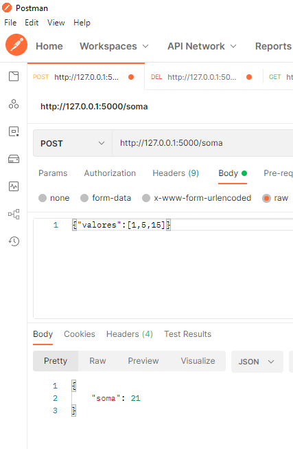
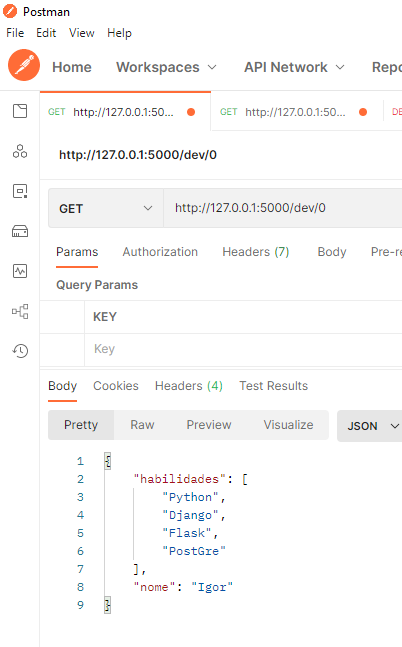
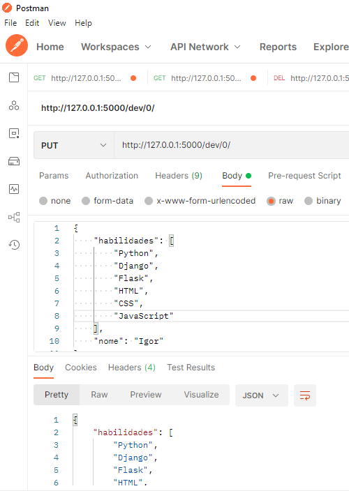
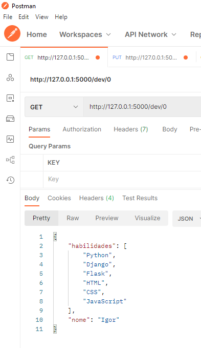

# Python-Com-Flask-e-REST-API
Framework Flask e como Desenvolver REST API através dela

### API soma:
POST no /soma passando valores no body:

### API devApp:
GET no dev/0:

alterando o dev/0 com o PUT:

Conferindo alteração com o GET no dev/0:

